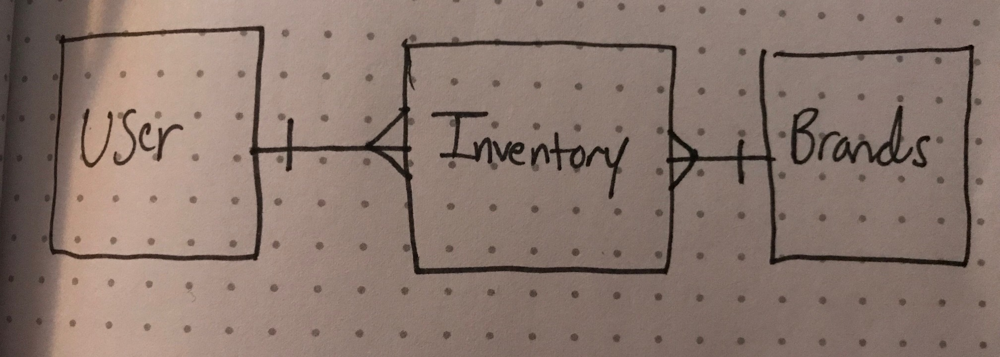

Here is the link to my front end code and launched pages website!

https://github.com/Thavriliak/snow-castle-front-end-client

Github Pages:
https://thavriliak.github.io/snow-castle-front-end-client/

For this backend section of my project, I made a many to many relationship between
Users and Brands, using inventories in the middle as a join table. I created this
backend using scaffolding through my terminal with Rails. Here is my ERD:

i connected my whole application to a deployed heroku site, and made AJAX requests
from my front end to my API to create new items in my database. In the future I
may want to add certain foreign keys for products. For example, we could make three
new tables for boots, bindings, and boards, and that way you could make new products
and add them by foreign key to the inventory.
